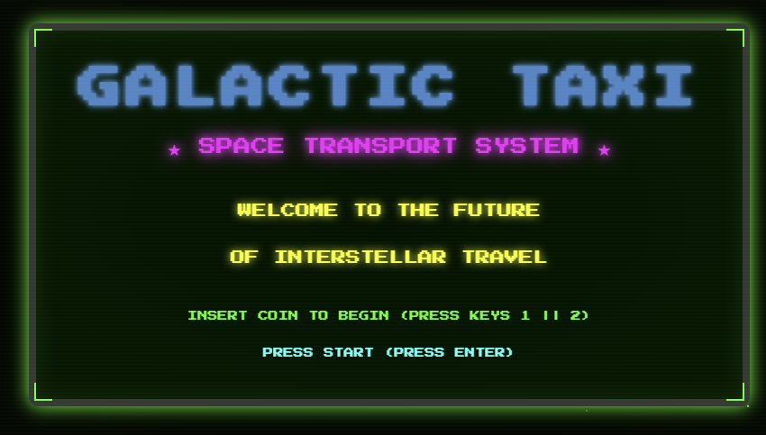

# Galactic Taxi 🚀

A retro 80s arcade-style web application built with Node.js and Fastify, featuring a stunning welcome screen inspired by classic arcade games and Star Wars aesthetics.



## Features

- 🎮 **Retro Arcade Design**: Beautiful 80s-style welcome screen with neon colors and pixel fonts
- ⚡ **Fastify Web Server**: High-performance Node.js web framework
- 🌟 **Star Wars Aesthetic**: Blue title text with glowing effects
- 📡 **RESTful API**: Welcome endpoint for programmatic access
- 🎨 **CRT Screen Effects**: Authentic scanline and glow effects for that classic arcade feel

## Prerequisites

- Node.js (v14 or higher)
- npm (comes with Node.js)

## Installation

1. Clone the repository or navigate to the project directory:
   ```bash
   cd xp-game-web
   ```

2. Install dependencies:
   ```bash
   npm install
   ```

## Usage

### Starting the Server

Start the development server:
```bash
npm start
```

The server will start on `http://localhost:3000`

### Accessing the Application

- **Web Interface**: Open your browser and navigate to `http://localhost:3000`
- **API Endpoint**: Access the welcome API at `http://localhost:3000/welcome`

## Project Structure

```
xp-game-web/
├── index.js              # Main server file
├── package.json          # Project dependencies and scripts
├── public/              # Static files directory
│   └── index.html       # Welcome page (retro arcade style)
└── README.md           # This file
```

## API Endpoints

### GET `/`
Returns the main welcome page (HTML).

**Response**: HTML page with retro arcade styling

### GET `/welcome`
Returns a welcome message as JSON.

**Response**:
```json
{
  "message": "Hello World Gary Black"
}
```

The message is also logged to the console.

## Technologies Used

- **Node.js**: JavaScript runtime
- **Fastify**: Fast and low overhead web framework
- **@fastify/static**: Static file serving plugin
- **Press Start 2P**: Google Fonts pixel font for authentic arcade feel

## Development

The application uses Fastify's built-in logger for development. All requests and server events are logged to the console.

## License

ISC

---

**Welcome to the future of interstellar travel!** 🌌
